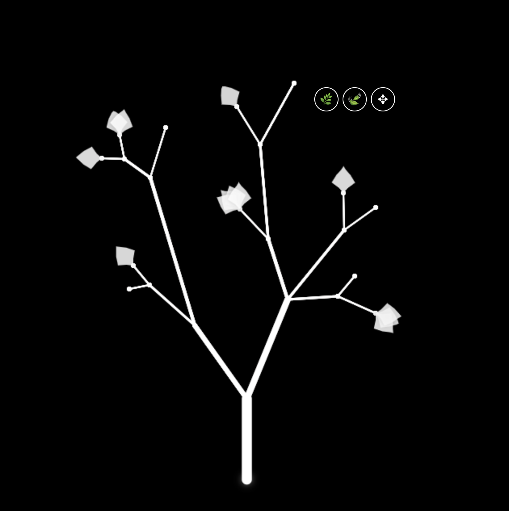

# TreeNote - Interactive Tree-Based Note-Taking Application

TreeNote is a unique note-taking application that organizes notes in a tree structure, where each note is represented as a leaf on a branch. The application provides an intuitive visual interface for creating, organizing, and managing notes in a hierarchical structure.

## Screenshot



*TreeNote interface showing a tree structure with multiple branches and leaves containing notes*

## Features

- Interactive tree visualization with drag-and-drop functionality
- Zoom and pan capabilities for easy navigation
- Dynamic branch thickness based on the number of child branches
- Beautiful leaf-shaped notes with subtle variations
- Real-time updates and persistence
- Responsive design that adapts to window size
- MongoDB backend for data persistence

## Project Structure

```
TreeNote/
├── app.js                 # Main server application
├── index.html            # Main HTML file
├── styles.css            # Global styles
├── js/                   # Frontend JavaScript files
│   ├── tree.js          # Main Tree class
│   ├── Node.js          # Node class for tree points
│   ├── Branch.js        # Branch class for connections
│   └── Leaf.js          # Leaf class for notes
├── server/              # Backend server files
│   ├── models/          # MongoDB models
│   │   ├── Tree.js      # Tree model
│   │   ├── Node.js      # Node model
│   │   ├── Branch.js    # Branch model
│   │   └── Leaf.js      # Leaf model
│   └── routes/          # API routes
│       └── tree.js      # Tree-related endpoints
└── package.json         # Project dependencies
```

## Prerequisites

- Node.js (v14 or higher)
- MongoDB (v4.4 or higher)
- npm (Node Package Manager)

## Installation

1. Clone the repository:
   ```bash
   git clone https://github.com/yourusername/TreeNote.git
   cd TreeNote
   ```

2. Install dependencies:
   ```bash
   npm install
   ```

3. Create a `.env` file in the root directory with the following variables:
   ```
   MONGODB_URI=mongodb://localhost:27017/treeNote
   PORT=3000
   ```

4. Start MongoDB:
   ```bash
   mongod
   ```

5. Start the application:
   ```bash
   npm start
   ```

The application will be available at `http://localhost:3000`

## API Endpoints

### Tree Operations

- `GET /api/tree`
  - Retrieves the entire tree structure
  - Returns: Tree object with nodes, branches, and leaves

- `POST /api/tree`
  - Creates a new tree
  - Body: `{ scale: number, offset: { x: number, y: number } }`
  - Returns: Created tree object

- `PUT /api/tree`
  - Updates the entire tree structure
  - Body: Complete tree object
  - Returns: Updated tree object

## Data Models

### Tree Model
```javascript
{
  scale: Number,          // Overall tree scale
  offset: {               // Tree position
    x: Number,
    y: Number
  },
  nodes: [ObjectId],      // References to Node documents
  branches: [ObjectId],   // References to Branch documents
  leaves: [ObjectId]      // References to Leaf documents
}
```

### Node Model
```javascript
{
  x: Number,              // X coordinate
  y: Number               // Y coordinate
}
```

### Branch Model
```javascript
{
  startNode: ObjectId,    // Reference to start Node
  endNode: ObjectId,      // Reference to end Node
  thickness: Number,      // Visual thickness
  children: [ObjectId],   // References to child branches
  parent: ObjectId        // Reference to parent branch
}
```

### Leaf Model
```javascript
{
  x: Number,              // X coordinate
  y: Number,              // Y coordinate
  note: String,           // Note content
  branchAngle: Number,    // Angle relative to branch
  leafIndex: Number,      // Position among leaves
  totalLeaves: Number,    // Total leaves on branch
  scale: Number,          // Visual scale
  rotation: Number        // Rotation angle
}
```

## Frontend Components

### Tree Class
The main class that manages the tree visualization and user interactions:
- Canvas setup and management
- Event handling (drag, zoom, pan)
- Branch and leaf management
- Drawing and rendering

### Node Class
Represents points in the tree structure:
- Position management
- Branch connections
- Unique identification

### Branch Class
Manages connections between nodes:
- Start and end node management
- Child branch relationships
- Thickness calculation
- Drawing and rendering

### Leaf Class
Handles note visualization and interaction:
- Position and rotation
- Note content
- Visual appearance
- Drag and drop functionality

## Usage

1. **Creating Notes**
   - Click on a branch to add a new leaf
   - Enter your note content
   - The leaf will be automatically positioned and styled

2. **Organizing Notes**
   - Drag branches to reorganize the tree structure
   - Add new branches by connecting nodes
   - The tree will automatically adjust branch thickness

3. **Navigation**
   - Drag the canvas to pan
   - Use the mouse wheel to zoom
   - The view will automatically center on the tree

4. **Editing Notes**
   - Click on a leaf to edit its content
   - Drag leaves to reposition them
   - The tree structure will update in real-time

## Contributing

1. Fork the repository
2. Create your feature branch (`git checkout -b feature/AmazingFeature`)
3. Commit your changes (`git commit -m 'Add some AmazingFeature'`)
4. Push to the branch (`git push origin feature/AmazingFeature`)
5. Open a Pull Request

## License

This project is licensed under the MIT License - see the LICENSE file for details.

## Acknowledgments

- Canvas API for rendering
- MongoDB for data persistence
- Express.js for the backend framework 